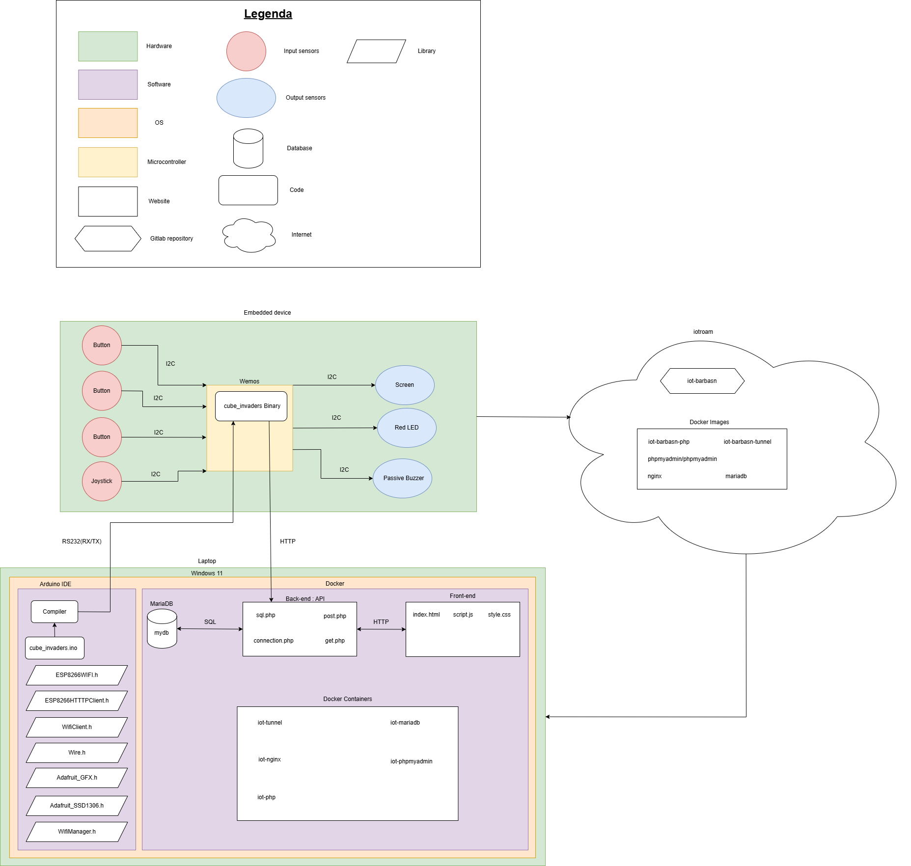

# System Architecture

The architecture of a system plays a critical role in the successful design and development of any connected object. It provides a structured blueprint that defines how hardware and software components interact, how data flows through the system, and how external communication is handled. A well-designed architecture ensures the system is efficient, scalable, maintainable, and secure. By carefully planning the system architecture, it allows to integrate new features more easily for example.   

 

