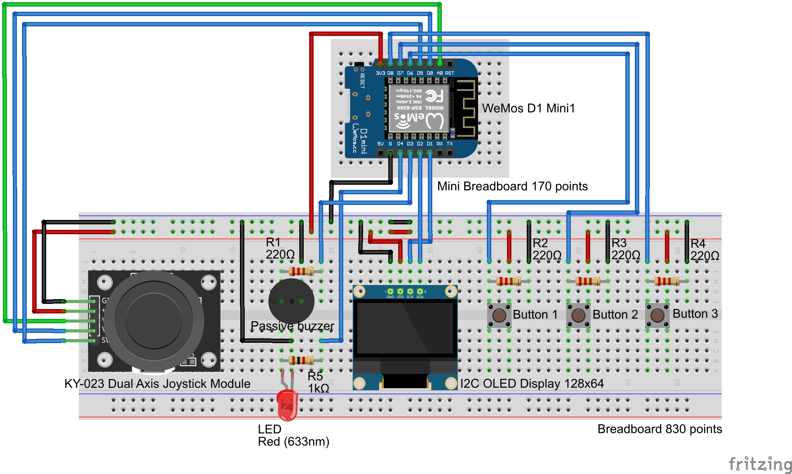

# Technical documentation
   

**Wiring diagram on Fritzing :**   

This is my fritzing schema showing all the components with their exact positions and connections, so that we can reproduce my product identically.   
 
   
   

 
 

**Bill of Materials :**   

This is my bill of materials, this table lists the components I use for my embedded system. By clicking on the unit price, you are redirected to a purchase site for the component. You also have access to documentation in the last column. At the end of this table we have the total price of all components.   
 
   
| Part #        | Manufacturer  | Description   | Quantity | Price    | Subtotal | Example url        |
|:--------------|:--------------|:--------------|:---------|:---------|:---------|:-------------------|
| Wemos d1 mini | LOLIN         | A mini WiFi microcontroller board | 1 | [5,54 €](https://nl.aliexpress.com/item/32529101036.html?gatewayAdapt=glo2nld) | 5,54 € | [Wemos Documentation](https://www.wemos.cc/en/latest/d1/d1_mini.html) |
| Push Button   | Mouser Electronics | A button to press | 3 | [0,95 €](https://www.addicore.com/products/large-tact-push-button-switch-12-x-12-x-7-2mm) | 2,85 € | [Push Button Documentation](https://docs.arduino.cc/built-in-examples/digital/InputPullupSerial/) |
| KY-023 Dual Axis Joystick Module | Joy-IT        | A dual axis joystick | 1 | [1,99 €](https://www.pcfelectronics.nl/en/dual-as-xy-joystick-module-for-arduino-ky-023.html) | 1,99 € | [Joystick Datasheet](https://naylampmechatronics.com/img/cms/Datasheets/000036%20-%20datasheet%20KY-023-Joy-IT.pdf) |
| Screen        | Adafruit      | I2C OLED Display with Arduino (mini) 128x64 | 1 | [7,00 €](https://www.tinytronics.nl/en/displays/oled/0.96-inch-oled-display-128*64-pixels-blue-i2c) | 7,00 € | [Screen Guide](https://randomnerdtutorials.com/guide-for-oled-display-with-arduino/) |
| Red LED       | Kingbright    | a led that make red light | 1 | [0,10 €](https://www.tinytronics.nl/en/components/leds/leds/red-led-5mm-diffuse) | 0,10 € | [LED Datasheet](https://www.farnell.com/datasheets/1498852.pdf) |
| Passive buzzer | FBelec       | a buzzer that make sound | 1 | [0,40 €](https://elektronicavoorjou.nl/product/3v-5v-passieve-buzzer/) | 0,40 € | [Passive buzzer Documentation](https://components101.com/misc/buzzer-pinout-working-datasheet) |
| Breadboard    | SparkFun      | Breadboard 830 points to put components | 1 | [3,99 €](https://www.benselectronics.nl/breadboard-830-points.html?srsltid=AfmBOop19_Db08apaUFej71S0Q0f0QRwSyja_SFfDQUZzezQx1q3HZBd) | 3,99 € | [Breadboard Documentation](https://www.jameco.com/Jameco/Products/ProdDS/2125026.pdf?srsltid=AfmBOorTDygeXwrehAclsZg9Wjjg68TXSqP-vdySDTNv2BnIhMndM5VP) |
| Mini breadboard | SparkFun    | Breadboard 170 points mini to put the wemos on it | 1 | [0,95 €](https://www.hobbyelectronica.nl/en/product/breadboard-170-insteekpunten-mini/?srsltid=AfmBOoq516kSdsv_lxoQdygXvxbV4qKnNDirdkiQpNFiHWJnj3d4IUdJ) | 0,95 € | [Breadboard Guide](https://learn.pimoroni.com/article/anatomy-of-a-mini-breadboard) |
| Jumper wire male-female | TinyTronics | cables to connect joystick to wemos| 5 | [0,05 € for 1 wire (0,50 € for 10 wires)](https://www.tinytronics.nl/en/cables-and-connectors/cables-and-adapters/prototyping-wires/dupont-compatible-and-jumper/dupont-jumper-wire-male-female-10cm-10-wires) | 0,25 € | [Wires documentation](https://docs.sunfounder.com/projects/sf-components/en/latest/component_wires.html) |
| Jumper wire male-male | Antratek | cables to connect components to wemos| 21 | [0,20 € for 1 wire (5,99 € for 30 wires)](https://www.antratek.nl/7-jumper-wires-30-stuks) | 4,20 € | [Wires documentation](https://docs.sunfounder.com/projects/sf-components/en/latest/component_wires.html) |
| Resistor 220 Ohm | Multicomp  | resistors for buttons and buzzer | 4 | [0,10 € for 1 resistor (0,96 € for 10 resistors)](https://www.kiwi-electronics.com/en/resistor-220-ohm-1-4-watt-5-10-pack-652?srsltid=AfmBOor5hC59iueDcE29Z4D1Zelja4PqMinYyHH8T6yKt6-3e3q5nzql) | 0,39 € | [Resistors documentation](https://www.anypcba.com/blogs/electronic-component-knowledge/decoding-the-220-ohm-resistor-applications-color-codes-and-practical-guide.html) |
| Resistor 1k Ohm | Multicomp   | resistor for the led | 1 | [0,10 € for 1 resistor (0,96 € for 10 resistors)](https://www.kiwi-electronics.com/en/passive-components-211/resistors-127/resistor-1k-ohm-1-4-watt-5-10-pack-656) | 0,10 € | [Resistors documentation](https://docs.rs-online.com/0c4b/A700000008919910.pdf) |   

 
Total : 27.76 €
