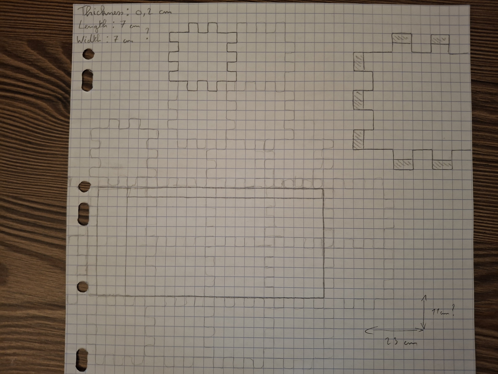
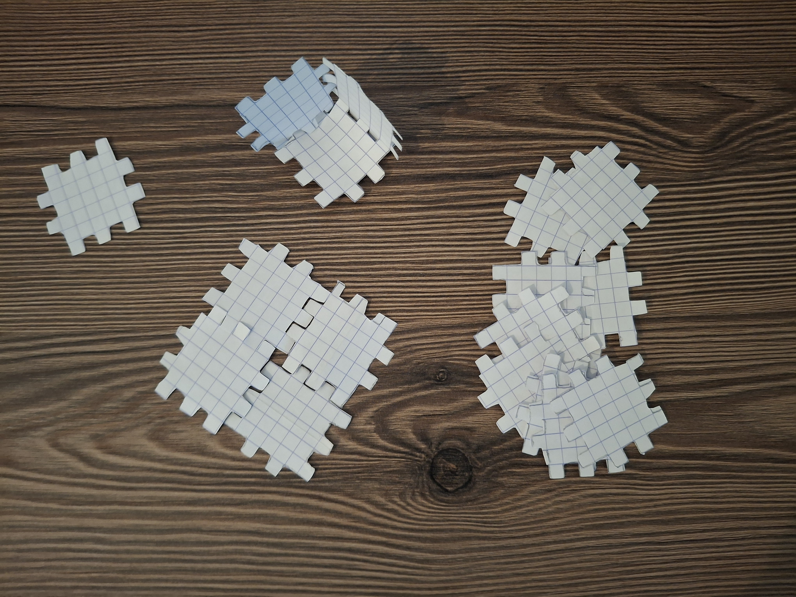
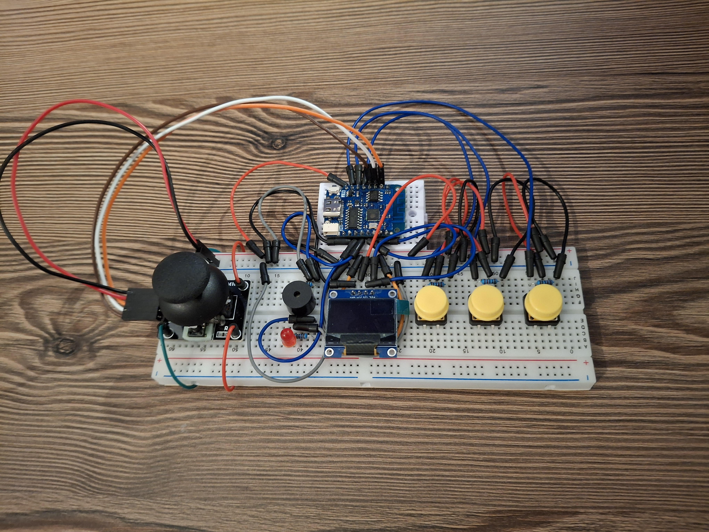
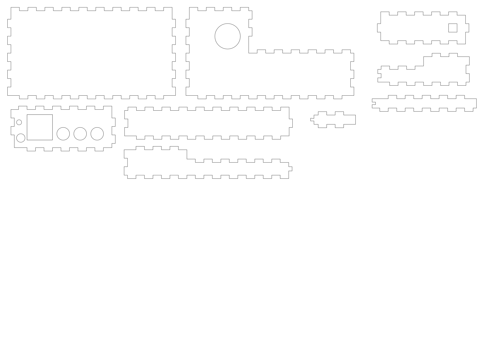

# Concept & Design

## **Smart Game Console**  

### - **CONCEPT**
   
Name : Cube Console
   
**Users and users needs :**   
A game console for all people, simply to use and with a little weight to be portable.   
The users want to spend time on a simple game.
   
**Main goal :**   
Play at a nice game on a handheld console.

### - **DIGITAL MANUFACTURING & MATERIAL**

I will use some wood (MDF 4 mm thickness) and cut my design with the laser cutting machine.

### - **DIGITAL DESIGN**

To make my 2D design for the laser cutting I used Inkscape.   
I put the line thikness at 0,250 mm as requested on the knowledgebase.

   
First I test to draw some shapes like a rectangle and I had a first idea of a piece :

After that I put on a paper a better version of my first idea and I try to think about the different sizes of my pieces :   

   

I make the design on Inkscape :

I make on Inkscape also a smallest version of the shape for the sides of my game console :

   

I decided to make some changes on my embedded device because I need a plane surface to put on the top a wood plate.   

This is before the changes :

   

This is after I bend the wires, change the position of the led to make a place for the shape around the joystick and I also cut a little bit the pins of the resistors and the led to be near the breadboard :

   

 
In the end, I realized that I had to start with larger pieces, each with its own shape, instead of making lots of small, similar pieces.   
 
I put all of my design in the same file to be more easily for the laser cutting. After a lot of work I am finally going to do these design : 

 

the file to be able to reproduce the game console :

[final product design](all_design.svg)   