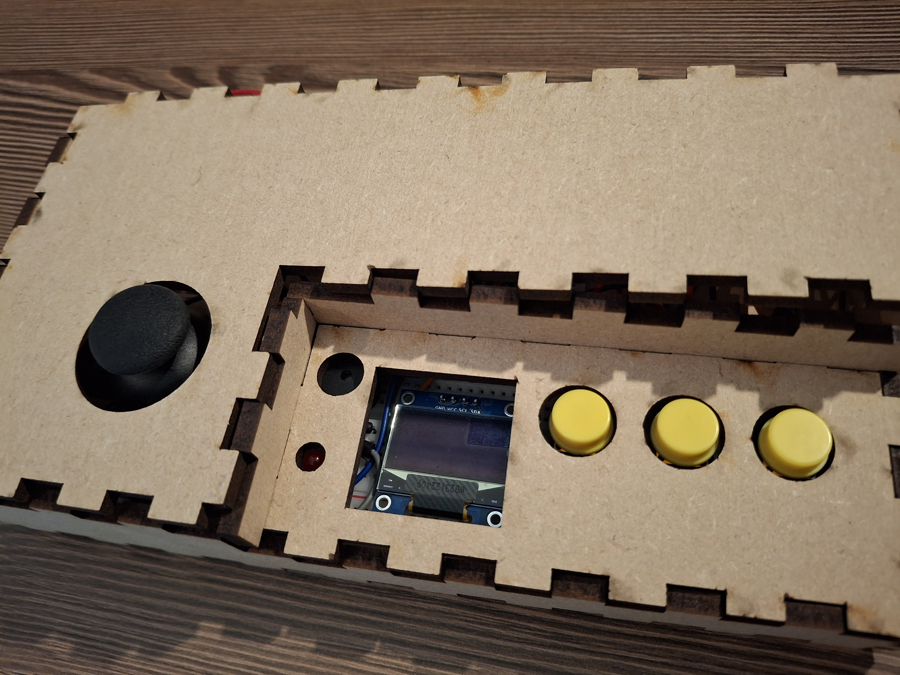
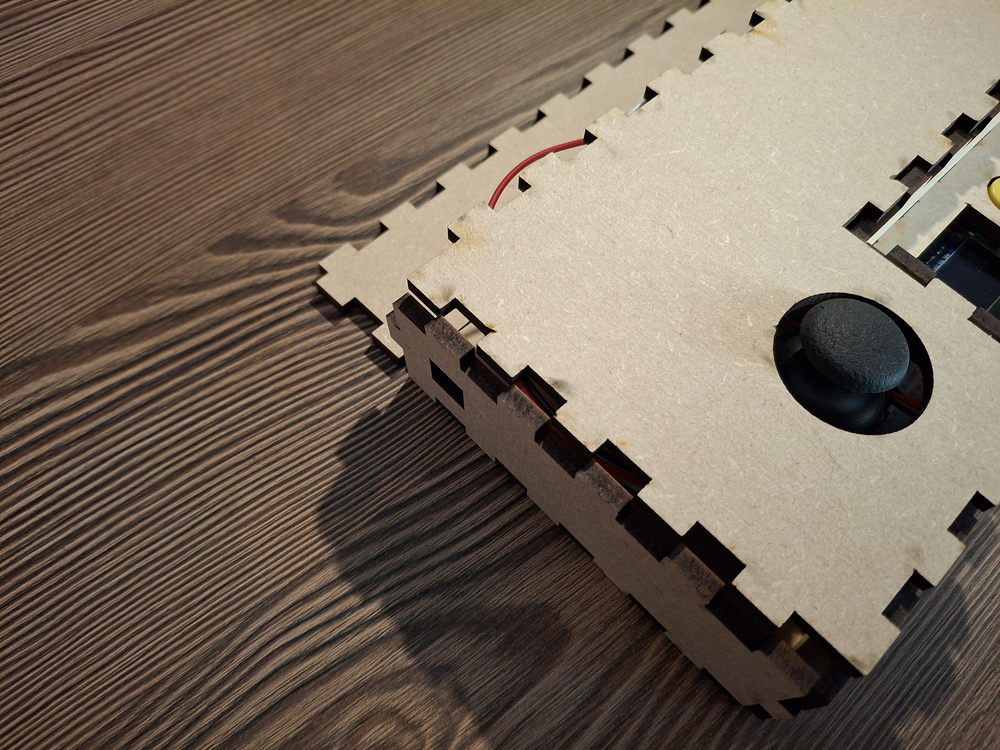
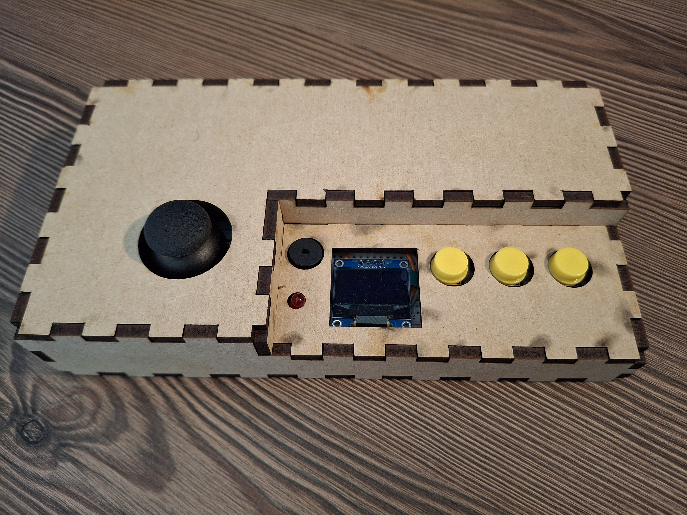

# Conclude & Reflect

- I have some failures like the hole for the buzzer, it's too small
- The hole for the buttons and the screen are too far left :

- Also, I need to fix the different parts between them because they don't stay fix and it move :

- there is some traces on the console due to laser cutting

To fix the wood plates between them I use a glue gun   

I change the design of these pieces to have space for the buzzer and to have the good dimensions :

   

The file to replicate the design :

[new design](redesign.svg)   

The game console after cutting and put the new version of pieces :   

