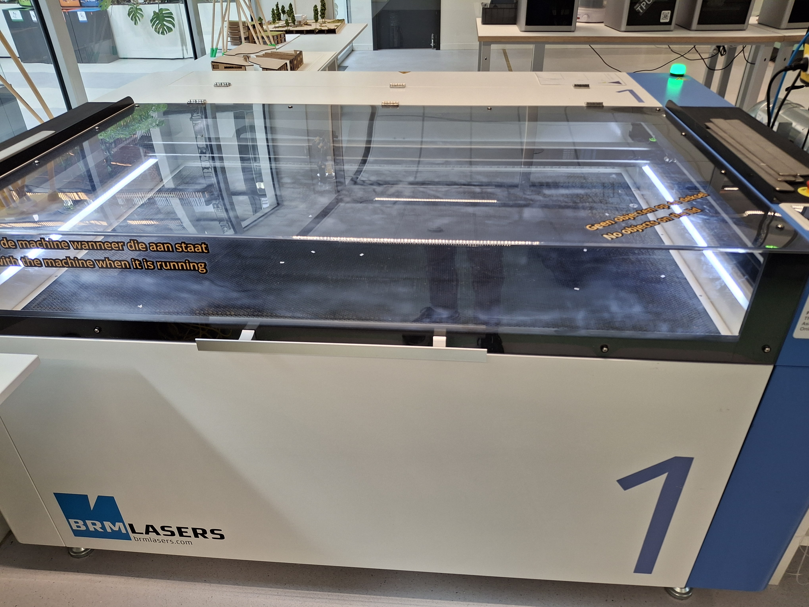
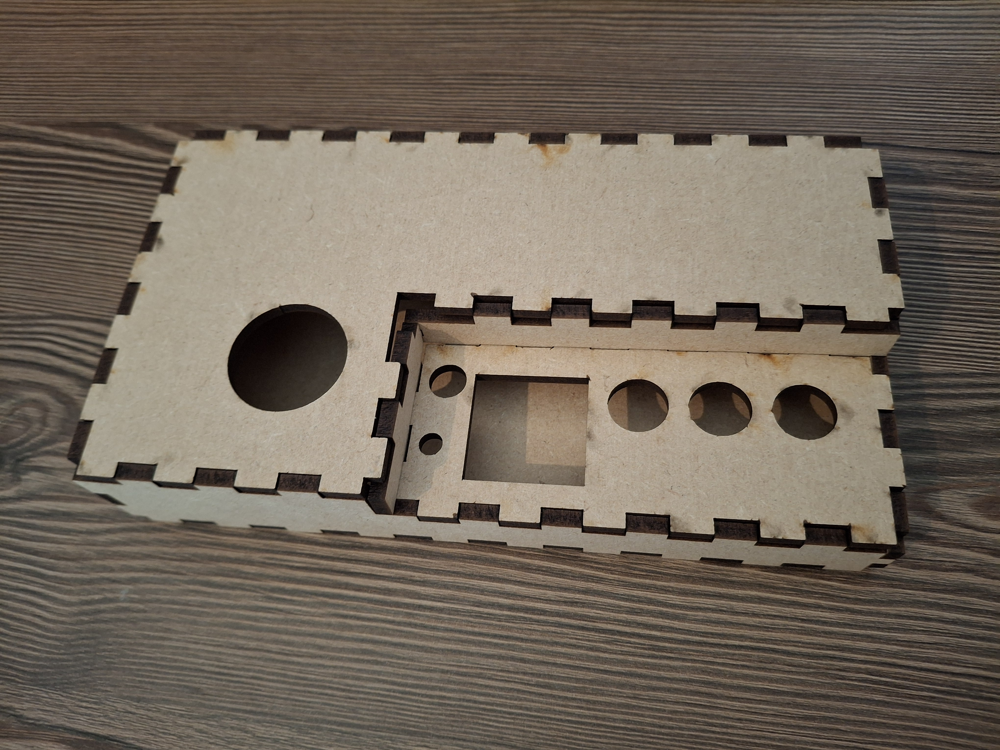
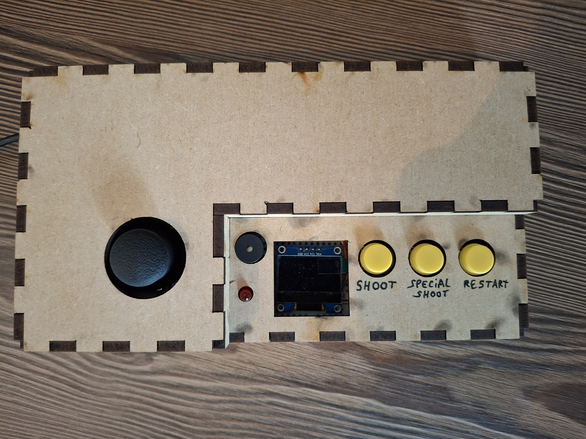

# Create & Test

## **Create**   

After finishing my design on Inkscape I go to the makerslab and I buy a MDF plate to put in the laser machine :
   

### - **DIGITAL MANUFACTURING & MATERIAL**

material specifications :

- material : MDF
- lenght : 600x600 mm
- thikness : 4 mm

software specifications :

- laser cutting software : LightBurn
- default parameters when MDF is selected

This is what my product look after building it :

## **User Test**   

Describe what (user) requirements you want to test :   

- is it easy to use ?
- is it clear ?
- is the controls are good ?
- what about the game ?

 
 

Describe how you are going tot test :   

Guerilla testing method :   
With this method we need to show our product to different persons and ask them to think aloud, we have enough feedbacks with this test to improve our product.   

 

three people have tested my console

 

Describe what works on your design and what you are going to change for you final version :   

With this test sessions I was able to identify strengths and weaknesses of my product :

**positive aspect :**   

- the console is easy to handle
- buttons are fine
- the physical design is nice
- the restart option is good

**negative aspect :**   

- importance of showing controls
- the joystick is too sensitive
- have a screen at the end of the game with the score
- make the middle button useful
- make a game over screen when we lose
- why the led is blinking ?

 
 

Optimise your design according to your manual manufacturing experience :   

